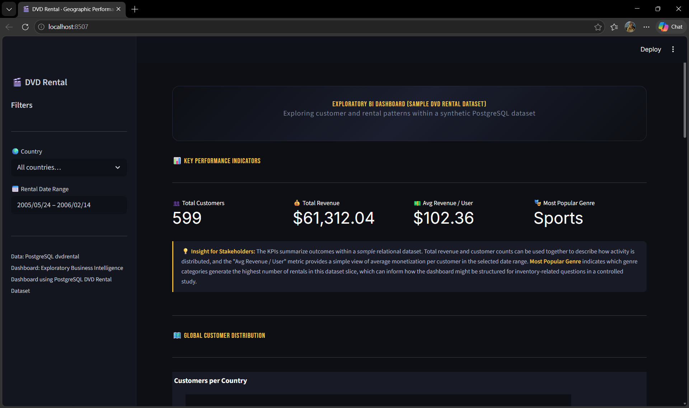
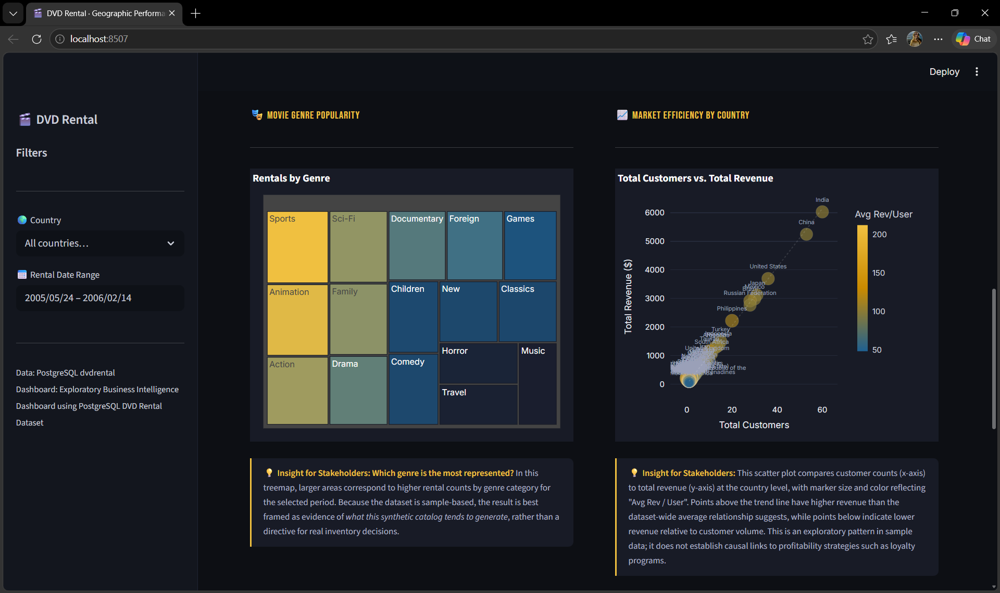

# 🎬 DVD Rental Analysis Dashboard

Exploratory Business Intelligence dashboard built using the PostgreSQL `dvdrental` sample database.  
This project focuses on customer activity, rental behavior, revenue distribution, and genre popularity through interactive visual analytics.

Built with **Streamlit**, **Plotly**, and **PostgreSQL**.

---

# 📌 Project Overview

This dashboard was created as an exploratory BI project to analyze patterns within the synthetic `dvdrental` dataset provided by PostgreSQL.

The goal of the project is not to simulate a real-world enterprise environment, but to demonstrate:
- interactive dashboard development
- SQL-based business analysis
- data visualization
- analytical storytelling
- stakeholder-oriented insight generation

The dashboard allows users to:
- filter data by country and rental date range
- analyze customer and revenue distribution
- explore genre popularity
- compare revenue efficiency between countries
- inspect ranking tables interactively

---

# 🛠️ Tech Stack

- Python
- Streamlit
- Plotly
- Pandas
- PostgreSQL
- SQLAlchemy

---
# 🗄️ Dataset / Database

This project uses the PostgreSQL sample database:

- PostgreSQL `dvdrental` database

You can download the sample dataset from:
https://www.postgresqltutorial.com/postgresql-getting-started/postgresql-sample-database/

After downloading:
1. Create a PostgreSQL database named `dvdrental`
2. Restore/import the provided `.tar` file
3. Update your database credentials inside `.streamlit/secrets.toml`
---
# 📊 Dashboard Features

## KPI Summary
Displays:
- Total Customers
- Total Revenue
- Average Revenue per User
- Most Popular Genre

---

## 🌍 Customer Distribution Map
Interactive choropleth map showing customer activity distribution across countries within the selected filters.

---

## 🎭 Genre Popularity Treemap
Treemap visualization showing rental count concentration by movie genre.

---

## 📈 Revenue vs Customer Scatter Plot
Scatter plot comparing:
- customer volume
- total revenue
- average revenue per customer

Used for exploratory pattern analysis.

---

## 📋 Revenue Ranking Table
Interactive ranking table of top-performing countries by revenue.

---

# ⚠️ Dataset Limitation

This project uses the PostgreSQL `dvdrental` sample database, which is a synthetic dataset designed for learning relational databases and business intelligence concepts.

Important considerations:
- geographic data does not represent real-world market operations
- store coverage is limited
- observed relationships are exploratory, not causal
- insights should be interpreted as educational BI analysis rather than operational business recommendations

This limitation is intentionally acknowledged to maintain analytical accuracy and defensible interpretation.

---

# 🧠 Analytical Framing

This dashboard emphasizes:
- exploratory analysis
- responsible interpretation
- contextual insight generation
- separation between correlation and causation

The project was later refined to improve methodological accuracy after evaluating the limitations of the sample dataset.

---

# 🚀 Installation

Clone this repository:

```bash
git clone https://github.com/TarleeneCannotCode/exploratory-bi-dashboard-dvdrental.git
```

Move into the project folder:

```bash
cd your-repository-name
```

Create virtual environment:

```bash
python -m venv venv
```

Activate virtual environment:

### Windows
```bash
venv\Scripts\activate
```

### macOS / Linux
```bash
source venv/bin/activate
```

Install dependencies:

```bash
pip install -r requirements.txt
```

Run the Streamlit app:

```bash
streamlit run app.py
```

---

# 📦 Requirements

```txt
streamlit>=1.32.0
pandas>=2.0.0
plotly>=5.18.0
sqlalchemy>=2.0.0
psycopg2-binary>=2.9.9
```

---

# 📷 Dashboard Preview


Example:
```md

```
```md


```
```md

```

---

# 🔮 Future Improvements

Possible future enhancements:
- Docker containerization
- role-based access
- advanced customer segmentation
- predictive analytics
- automated reporting export
- deployment to Streamlit Cloud or Render

---

# 👤 Author

Developed by [Dimas Lintar Ramadhan]

Business Intelligence · Data Visualization · Exploratory Analytics